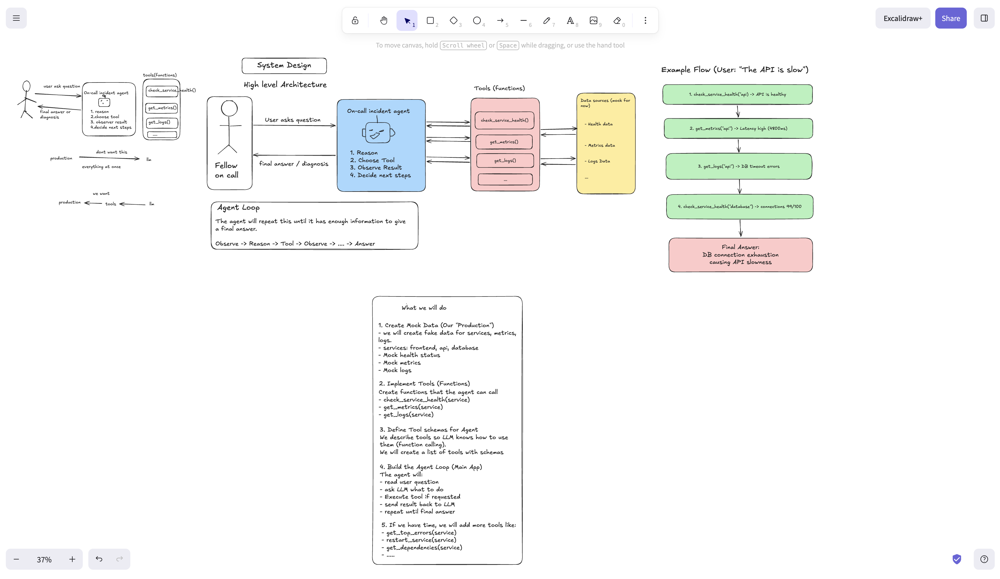

# Mini On-Call Incident Agent

A minimal Python AI agent for learning how agents work through a Production Engineering use case.

The agent investigates mock production incidents using health checks, metrics, logs, and service dependencies to identify a likely root cause.

## How It Works

> User reports an incident -> AI Agent -> Chooses a tool -> Inspects production -> Observes the result -> Chooses another tool if needed -> Returns a diagnosis.

The mock production environment contains three services:

- Frontend
- API
- Database

The agent has four read-only tools:

* `check_service_health()`
* `get_service_metrics()`
* `get_service_logs()`
* `get_service_dependencies()`

The model decides which tool to use and when it has gathered enough evidence to provide a diagnosis.

## System Design

A high level overview of the system:



## Setup

Create and activate a virtual environment:

```bash
python3 -m venv .venv
source .venv/bin/activate
```

Install dependencies:

```bash
pip install -r requirements.txt
```

Create a `.env` file:

```text
OPENAI_API_KEY=your_api_key_here
```

## Run

Test the mock production environment:

```bash
python production.py
```

Test the tools:

```bash
python tools.py
```

Run the agent:

```bash
python agent.py
```

Or use the interactive CLI:

```bash
python main.py
```

Example incident:

```text
Users report that the API is very slow.
```

The agent can follow evidence from the API into its dependencies and determine that the underlying issue is elsewhere in the system.

## Concepts Covered

* AI agents and agent loops
* Tool/function calling
* Health checks
* Metrics and logs
* Service dependencies
* Observability
* Incident investigation
* Root-cause analysis
* Read-only agent permissions

I intentionally use plain Python instead of an agent framework so the core agent loop remains visible and easy to understand.
